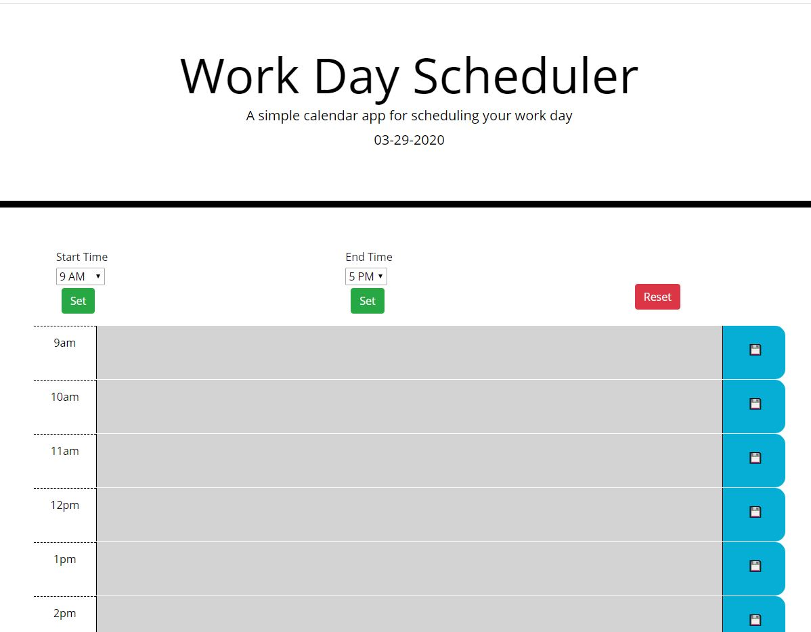
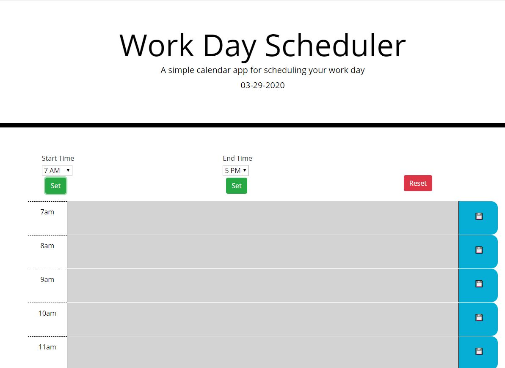
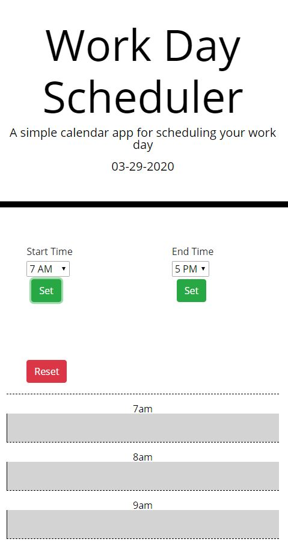

# Work-Day-Scheduler

# Project Title
Week 5 Homework Assignment - Work Day Scheduler

# Motivation 
This homework will deliver a workday scheduling application that allows practice of utilizing Jquery and local storage. Additionally, it will support interaction with a third party API to both pull and format data. 

# Code Style
This project is written using Java script and the Bootstrap CDN for layout and mobile responsiveness. Jquery is used for selectors and manipulation of the Dom. Moment.js calls are made to get the current time and format the existing time into a universal field for processing and comparison.

# Screenshots

Full Screen View

Expanded Hours View

Mobile Layout View

# Features
Schedule fields are dyanmically created to allow for edited configuration.

Interval timer updates coloring of hour blocks without refresh.

Additional buttons allow for expansion of work day and reset.

# Code Example
This function does the double duty of setting up initial displays and running at intervals to update color coding. The mod flag allows it to ignore text being entered and not erase it

function updateSlots(mod) {
    var i = 0;
    while (x) {
        var currentRow = $("#schedule").children(".row").eq(i);
        var currentDescription = currentRow.children(".description");
        // Cycles until empty element returned
        if (currentRow.length == 0) {
            return;
        }
        var rowTime = currentRow.attr("id");
        var rowLoad = "WD" + moment().format("MMDDYYYY") + rowTime;
        // Checks parsed time against current time
        if (parseInt(rowTime) < parseInt(moment().format("H"))) {
            currentDescription.attr("class", "col-md-10 description past");
        }
        else if (parseInt(rowTime) > parseInt(moment().format("H"))) {
            currentDescription.attr("class", "col-md-10 description future");
        }
        else {
            currentDescription.attr("class", "col-md-10 description present");
        }
        // Checks for existing saved events. Flag allows updating of just colors without modifying text
        if (localStorage.getItem(rowLoad) != null && mod != false) {
            currentDescription.children("textarea").text(localStorage.getItem(rowLoad));
        }
        i++
    }
}

The local storage item is set with a two letter identifier, the current date, and the chosen time slot for easy reference and persistence

function schedListener() {
    $(".scheduleButton").on("click", function () {
        var schedText = $(this).parent().parent().children(".description").children("textarea").val();
        var schedId = $(this).parent().parent().attr("id");
        // Creates record reference based on current date and row time
        schedId = "WD" + moment().format("MMDDYYYY") + schedId;
        localStorage.setItem(schedId, schedText);
    })
}

# How to Use
Accessible at https://ravalash.github.io/Work-Day-Scheduler/. Enter scheduled events and click on the save button to the right to lock it into memory. To change the start and end of day times, choose a time from the drop down and click the button below to confirm. The reset button will allow all entries in memory to be deleted with a prompt for confirmation.
